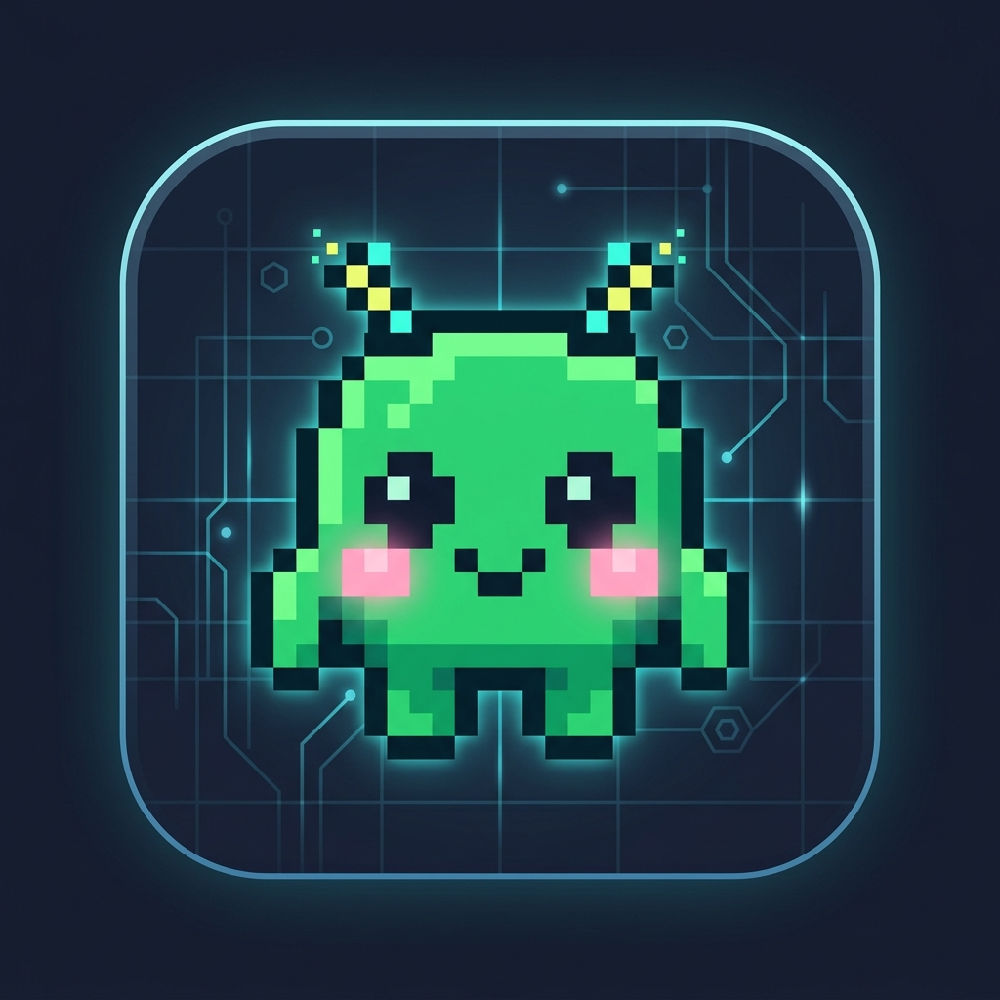

<p align="center">
  
</p>

<h1 align="center">👾 BITDOKU</h1>

<p align="center">
  <strong>A cozy, retro-tech logic puzzle game built on the Star Battle / Queens mechanic.</strong><br>
  <em>Partition memory blocks, place kawaii 8-bit bit-sprites, and master cybernetic registers offline.</em>
</p>

<p align="center">
  
  
  
  
  
</p>

---

## 📖 About The Game

**Bitdoku** is a cozy, tactile retro-terminal puzzle game. Players act as a system memory operator allocating kawaii 8-bit bit-sprites (👾) across an $N \times N$ partitioned grid representing hardware memory sectors.

### 🎮 The Core Rules

1. **One Bit Per Memory Region**: Exactly 1 bit per colored partition.
2. **One Bit Per Row & Column**: Exactly 1 bit in every row, and 1 bit in every column.
3. **No Touching (Electrostatic Isolation)**: No two bits may touch horizontally, vertically, or diagonally.

---

## 📱 How to Install as a PWA (Mobile & Desktop)

Bitdoku is built as a progressive web app (PWA) with **offline-first capability**. Once loaded, campaign sectors, auto-saves, and progression operate without internet connectivity.

### 🍏 iOS (iPhone & iPad Safari)
1. Open Safari and navigate to your Bitdoku URL (e.g. `https://bitdoku.jhnbrd.com` or local network IP).
2. Tap the **Share** button (the square icon with an upward arrow at the bottom of the screen).
3. Scroll down and tap **"Add to Home Screen"** (`[+]`).
4. (Optional) Name it **Bitdoku** and tap **Add** in the top right.
5. Bitdoku will now launch fullscreen directly from your Home Screen with a standalone app experience, custom icon, and offline storage.

### 🤖 Android (Chrome & Edge)
1. Open Google Chrome and visit your Bitdoku URL.
2. A prompt banner **"Add Bitdoku to Home screen"** will automatically appear at the bottom.
3. If not shown, tap the **three dots menu (⋮)** in the top right corner.
4. Select **"Install app"** or **"Add to Home screen"**.
5. Tap **Install** to confirm.
6. Bitdoku is installed as a native-feeling application in your app drawer and home screen.

### 💻 Desktop (Chrome, Edge, Brave, Safari Mac)
1. In Chromium browsers, click the **Install icon** in the right side of the address bar.
2. Click **Install**. Bitdoku opens in its own distraction-free window.

---

## ✨ Features

- **Cozy Lo-Fi Cyber Aesthetic**: Soft slate palette, CRT scanline overlay, glowing phosphor accents (`#10b981`, `#06b6d4`, `#8b5cf6`), and JetBrains Mono monospace typography.
- **Minimalist Progression Hub**: No cluttered level dumps. Progress through sectors incrementally with a focused **"Continue Playing"** card and live sector counter.
- **Drag-to-Mark Gesture**: Drag your finger or mouse across the board to rapidly mark multiple crosses (X) in milliseconds.
- **Tactile Synthesized Audio**: Built-in Web Audio API mechanical keyboard switch clicks, cross scratch sounds, conflict alarms, and kawaii 8-bit victory chimes.
- **Persistent On-Screen Rule Guide**: Never forget constraints with the ambient header guide.
- **Safety Settings**: One-click progress purge and audio toggles in the system configuration menu.
- **Seed-Generated Daily Protocols**: Daily puzzle seeded at 00:00 UTC with global leaderboard rankings.

---

## 🕹️ Difficulty Matrix

| Difficulty | Grid Size | Partitions | Integrity (Lives) | Offline Sectors |
| :--- | :--- | :--- | :--- | :--- |
| **Easy** | $6 \times 6$ | 6 regions | 3 Hearts | 30 Sectors |
| **Normal** | $8 \times 8$ | 8 regions | 3 Hearts | 50 Sectors |
| **Hard** | $9 \times 9$ | 9 regions | 2 Hearts | 40 Sectors |
| **Very Hard** | $10 \times 10$ | 10 regions | 1 Life (Flawless) | 30 Sectors |
| **Daily Protocol** | $8 \times 8$ | 8 regions | 3 Hearts | New puzzle daily |

---

## 🛠️ Architecture & Tech Stack

```
Bitdoku/
├── public/                # App icons (192, 512, apple-touch-icon, logo.png)
├── src/
│   ├── audio/             # Web Audio API retro synthesizer
│   ├── components/        # GridBoard (touch drag), GameControls, LevelSelect, Modals
│   ├── db/                # Dexie.js (IndexedDB local offline storage)
│   ├── game/              # Star Battle solver, generator & rules engine
│   ├── types/             # TypeScript definitions
│   ├── App.tsx            # Main game state loop
│   └── index.css          # Tailwind CSS v4 & CRT scanline effects
├── server/
│   ├── db.ts              # SQLite database (WAL mode)
│   └── index.ts           # Express API (sync, scores, leaderboards, daily)
└── vite.config.ts         # Vite 8 + VitePWA + Tailwind v4
```

---

## ⚡ Local Development

### Prerequisites
- Node.js 18+
- npm

### 1. Install dependencies
```bash
npm install
```

### 2. Run both Client & Server
```bash
npm run dev:all
```
- **Web App**: `http://localhost:8073`
- **API Node**: `http://localhost:3001`

### 3. Run individually
```bash
# Frontend only
npm run dev

# Backend only
npm run dev:server
```

### 4. Build for Production
```bash
npm run build
```
Compiles production assets and pre-caches the PWA service worker inside `dist/`.

---

## ☁️ Remote Tunneling (Cloudflare Tunnel)

To serve Bitdoku securely over HTTPS with automated SSL on your custom domain:

```bash
cloudflared tunnel run bitdoku
```
Forward port `8073` (or production build server) directly to your domain `bitdoku.jhnbrd.com`.
